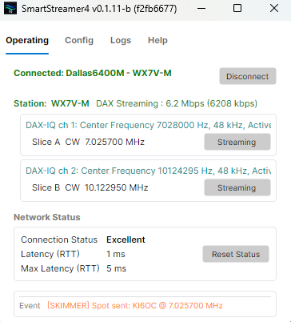

# SmartStreamer4

Modernizes CW Skimmer integration with FlexRadio DAX-IQ streams using a dedicated Avalonia desktop app.
License: MIT (see `LICENSE`).




## 1) Quick Start

### First-Time Setup / Get Started

- Launch `SmartStreamer4.exe`. If Windows prompts for firewall access, allow the app through Windows Firewall.
- Click the streamer's `Config` tab and set the local path to `CwSkimmer.exe` and the associated INI file.
- Before first streamer launch on a machine, run CW Skimmer manually and calibrate only `DAX IQ RX 1` + `DAX Audio RX 1`, then exit CW Skimmer to save `CwSkimmer.ini`.
- In the `Operating` tab, click the radio and press **Connect**. After a few seconds you should see the available slices and IQ streams needed to launch CW Skimmer.
- Once CW Skimmer is running, view settings and verify the `Radio`, `Audio`, and `Operator` tabs are correct for your station.
- Click **Start** in the CW Skimmer toolbar to begin decoding.
- Finally, click the streamer's `Logs` tab to see real-time events from `[STREAMER]`, `[SKIMMER]`, and `[TELNET]` to verify connect, launch, and sync direction (VFO vs Skimmer click-tune).

## 2) Technology Stack

- UI: Avalonia (`net8.0-windows`)
- App pattern: MVVM (`CommunityToolkit.Mvvm`)
- Radio integration: FlexRadio FlexLib API `v4.1.5.39794`
- CW decoder integration: CW Skimmer process + Telnet control channel

## 3) High-Level Architecture

- `MainWindowViewModel` orchestrates discovery, connection, DAX stream state, CW Skimmer launch/sync, and spot publishing.
- `src/SmartSDRIQStreamer.FlexRadio` isolates FlexLib-specific discovery/connection and radio operations.
- `src/SmartSDRIQStreamer.CWSkimmer` isolates CW Skimmer INI generation, process launch, Telnet control, and spot parsing.
- UI is organized into tabs:
  - `Operating`: radio target selection + stream/launch operations + live event line
  - `Config`: CW Skimmer paths + spot controls + Telnet INI view
  - `Logs`: consolidated streamer status output + quick open to logs folder

## 4) FlexRadio Integration Approach

- Use local-network discovery and a single-radio connect model.
- Track panadapters, slices, and DAX-IQ streams via FlexLib events.
- Publish CW spots through FlexLib spot API with app-defined text/background color and lifetime.

## 5) CW Skimmer Integration Approach

- Build channel-specific managed INI files from a user-selected template.
- Device mapping model is machine-local calibration:
  - operator calibrates manual `CwSkimmer.ini` for channel 1 (`DAX IQ RX 1` + `DAX Audio RX 1`),
  - streamer derives channel `N` WDM indices by offset from that baseline on first channel-INI creation.
- If operator corrects channel device selections in CW Skimmer and exits, streamer preserves existing channel INI `[Audio]` values on later launches.
- Launch CW Skimmer per DAX-IQ channel and connect a Telnet client.
- Runtime sync model:
  - Slice frequency updates drive channel-matched `SKIMMER/QSY`.
  - Pan center or band changes trigger channel-matched `SKIMMER/LO_FREQ` plus an immediate effective-RX `SKIMMER/QSY` re-assert.
  - A short delayed QSY stability resend follows pan/band-driven LO updates to keep CW Skimmer VFO display aligned after transient UI/state shifts.
- Parse `DX de` lines and forward valid spots to radio when spot forwarding is enabled.
- Preserve CW Skimmer-owned config sections while writing runtime-managed sections (`[Audio]`, `[Telnet]`).

## 6) Development Prerequisites

- Windows 10/11
- .NET SDK 8.x
- SmartSDR + DAX installed and running
- CW Skimmer installed
- FLEX-6x00/8x00 radio reachable on local network
- Local radio required in the current implementation (SmartLink/VPN deferred)
- FlexLib API package downloaded and extracted to `FlexLib_API_v4.1.5.39794` in project root

## 7) Build, Run, Test

### Build

```powershell
dotnet build
```

### Run (development)

```powershell
dotnet run
```

### Run (Release executable)

```powershell
dotnet build -c Release
.\bin\Release\net8.0-windows\SmartStreamer4.exe
```

### Release Packaging

```powershell
powershell -ExecutionPolicy Bypass -File .\publish-release.ps1 -Configuration Release -Runtime win-x64
```

- Publish GitHub releases with attached binaries (`SmartStreamer4-v<version>-win-x64.zip`) and checksum asset (`SHA256SUMS.txt`).

### Tests

```powershell
dotnet test tests
```

## 8) Project Layout

```text
SmartStreamer4/
├── SmartSDR-IQ-Streamer.MDC
├── SmartSDRIQStreamer.csproj
├── README.md
├── SmartSDRIQStreamer.slnx
├── Program.cs
├── App.axaml / App.axaml.cs
├── AppServices.cs
├── MainWindow.axaml / MainWindow.axaml.cs
├── CwSkimmerWorkflowService.cs
├── FooterStatusBuffer.cs
├── src/
│   ├── SmartSDRIQStreamer.FlexRadio/
│   └── SmartSDRIQStreamer.CWSkimmer/
├── tests/
│   └── SmartSDRIQStreamer.CWSkimmer.Tests/
└── artifacts/
```

## 9) Phase Status

- Phase 1 (Foundation): COMPLETE
- Phase 2.1 (CW config + INI write): COMPLETE
- Phase 2.2 (CW launch): COMPLETE
- Phase 2.3 (Runtime sync): COMPLETE (including fine-tuned LO/panadapter/slice synchronization hardening)
- Phase 3 (Polish / hardening): COMPLETE
- Phase 3.1 (Bridge spots): COMPLETE baseline (forwarding, controls, diagnostics)
- Phase 3.2 (RIT fine tuning sync): COMPLETE
- Phase 3.3 (Network quality monitor): COMPLETE
- Phase 3.4 (Configuration pages): COMPLETE
- Phase 3.5 (Operating page simplification): COMPLETE

## 10) Notes

- `FlexLib_API_v4.1.5.39794` is intentionally excluded from version control.
- Download FlexLib API (SmartSDR v4): [https://www.flexradio.com/software/smartsdr-v4-x-api-flexlib/](https://www.flexradio.com/software/smartsdr-v4-x-api-flexlib/)
- Build may emit legacy FlexLib warnings on `net8.0-windows`; tracked separately.
- Phase status and roadmap tracking are maintained in `SmartSDR-IQ-Streamer.MDC` (single source of truth).
- Runtime artifacts:
  - `artifacts/cwskimmer/ini` for per-channel INI and diagnostics
  - `artifacts/logs` for runtime status logs

## 11) Alpha.6 Validation Snapshot

- Run start: `2026-04-16 20:15:23` (`Release: 0.1.0-alpha.6`, `Commit: 1260b434`).
- Initial radio connect: `2026-04-16 20:15:36` to FLEX-6600.
- Telnet startup recovered from one remote-close event (`20:16:10`) with reconnect at `20:16:23`.
- Observed activity window: through at least `2026-04-17 06:53`.
- Spot publish counts from captured logs: `10362` attempts, `10362` success, `0` failed.
- Spot persistence usage confirmed in publish payloads with `lifetime_seconds=600`.
