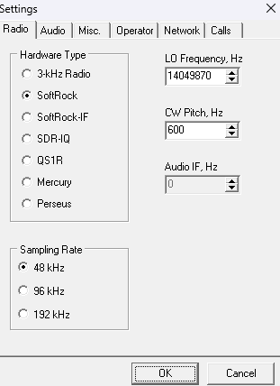
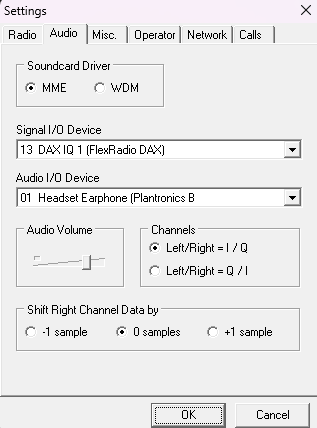
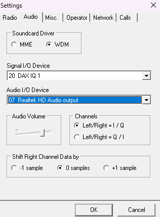
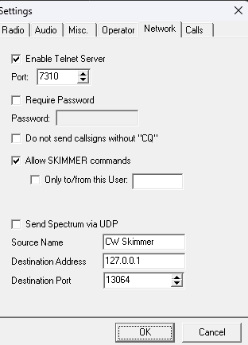
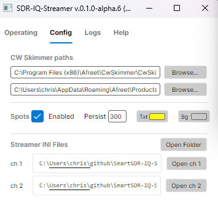
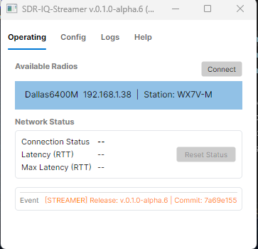
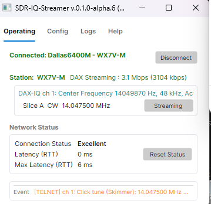
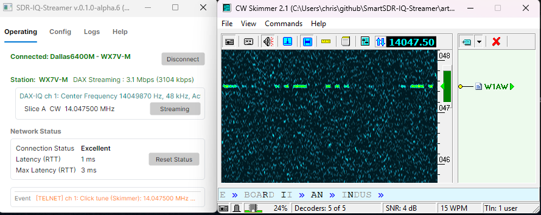

# SmartStreamer4 Setup Guide (Wizard Style)

This guide walks through setup in a step-by-step flow, including CW Skimmer master INI preparation and operational troubleshooting.

---

## Step 0 - Prerequisites Checklist

Before launching the streamer, confirm:

- Windows 10/11 is supported today (FlexLib .NET 8.0 requirement)
- FLEX-6000/8000 radio is powered on and connected to the local network
- SmartSDR 4.x installed and running (SmartStreamer4 is designed for SmartSDR 4.x; firmware ≥ 3.3.32 required)
- DAX 4.x installed and running
- CW Skimmer v2.1 installed

If any item above is missing, stop and fix that first. Common issues include:

- Not enabling a DAX-IQ stream in the SmartSDR panadapter.
- Not enabling the matching DAX-IQ channel in SmartSDR DAX (blue/streaming).

- The radio and skimmer software prerequisites can be downloaded from these sites as of 4/20/2026:
  - [https://www.flexradio.com/ssdr/](https://www.flexradio.com/ssdr/)
  - [https://www.dxatlas.com/CwSkimmer/](https://www.dxatlas.com/CwSkimmer/)


---

## Step 1 - Prepare CW Skimmer Master INI (Standalone First)

This is the most important setup step. The streamer uses your CW Skimmer master INI as the template source for first-time channel INI creation.

1. Find the path to your CwSkimmer.exe and its associated `cwskimmer.ini`
2. Launch `CwSkimmer.exe` manually (not from streamer).
3. Recommendations on What to Choose will be covered in the next step.
4. This will result in a known-good baseline should the streamer configuration ever need to be reset.

  
If this master INI is wrong, streamer-launched sessions will inherit bad defaults. Always close CW Skimmer from its own window to ensure any settings you changed are reused next time CW Skimmer is run.

Things that will be saved include the window size and position (geometry), along with the Radio, Audio and Network settings.

  
Typical Skimmer Exe Path:

```
C:\Program Files (x86)\Afreet\CwSkimmer\CwSkimmer.exe
```

  
Typical Skimmer Ini config Path (replace user name as appropriate with your own config):

```
C:\Users\chris\AppData\Roaming\Afreet\Products\CwSkimmer\CwSkimmer.ini
```


---

## Step 2 - CW Skimmer Tab Guidance (What to Choose)

Use this section while running CW Skimmer standalone.

### Radio tab

- Confirm radio/source mode is correct for your operating workflow.
- Verify frequency display behavior and tuning expectations are correct.
- Save and verify reopen behavior.
- Hardware Type should be SoftRock.
- Sample Rate should be 48 kHz for most machines, and should match the SmartSDR DAX-IQ stream sample rate.
- LO Frequency (Hz) should match the center frequency of the active IQ stream.
- CW Pitch should match the pitch configured in SmartSDR.



### Audio tab

SmartSDR 4.x exposes the DAX IQ stream as a standard audio device. Configure as follows:

- **Soundcard Driver**: **MME — required for multi-channel auto-derivation.** SmartStreamer4 only reliably supports MME today; it auto-derives the correct `MmeSignalDev` for each DAX-IQ channel by looking up `DAX IQ {N}` in the live WinMM enumeration. WDM is **experimental** because CW Skimmer's WDM device dropdown uses an opaque ordering that cannot be replicated programmatically (see [issue #19](https://github.com/cdub89/SmartStreamer4/issues/19)). If you choose WDM, only the calibrated baseline channel will work; channels 2-4 must each be launched manually once in CW Skimmer with their device picked by hand and saved.
- **Signal I/O Device** (MME): select `DAX IQ 1 (FlexRadio DAX)`. Channels 2-4 are resolved automatically at launch — do not change this for the master INI.
- **Audio I/O Device**: select any local audio output (e.g. `Realtek HD Audio output`). No DAX Audio RX device is needed or available here — this slot is for CW Skimmer's local audio monitoring only.
- **Channels**: `Left/Right = I / Q`
- **Shift Right Channel Data by**: `0 samples`

Confirm input levels are active and stable (not clipping, not flatline) after connecting.

MME (supported, recommended):


WDM (experimental — single-channel only without manual per-channel calibration):


### Operator tab

- Set operator identity/callsign and any operator-level defaults.
- Validate that operator info is preserved after close/reopen.

### Network tab

- Confirm telnet/network settings are valid for local operation.
- Ensure port configuration does not conflict with other local services.
- Validate settings persist after save and restart.


After all tab settings are validated, save, set the CW Skimmer window size and position, then close CW Skimmer normally.

---

## Step 3 - Configure Streamer Paths

1. Launch `SmartStreamer4.exe`.
2. Open the `Config` tab.
3. Set:
  - `CwSkimmer.exe` path
  - master `cwskimmer.ini` path (from Step 1)
4. Confirm paths are valid and point to real files.

Spot persistence and colors:

- In `Config`, use `Persist` to control spot lifetime (seconds) for newly published spots.
- Use `Txt` to choose spot text color and `Bg` to choose spot background color.
- Start with a readable combination (for example yellow text on transparent/dark background).
- Validate by publishing at least one known spot and confirming appearance in SmartSDR panadapter.

Streamer Config example:


---

## Step 4 - Connect and Validate Radio State

1. Go to `Operating`.
2. Select radio target and click `Connect`.
3. Confirm connected station/pan/slice state appears correctly.
4. Confirm DAX-IQ context is available for intended channels.

Operating tab connected example:


If connect fails, resolve radio/network/discovery issues before continuing.

---

## Step 5 - Start and Stop Skimming

Per slice, use the skimmer action button:

- `Start` means skimmer is not running for that slice channel.
- `Streaming` means skimmer is running for that slice channel.

Normal flow:

1. Click `Start` on target slice row.
2. Wait for CW Skimmer window and startup status.
3. Verify decode activity and expected frequency behavior.

Operating tab while skimming example:


To stop from streamer:

1. Click `Streaming` on the active slice row.
2. Confirm CW Skimmer instance stops for that channel.

To stop manually (required if you've made config changes you want saved for the next time you start CW Skimmer):

1. Close CW Skimmer window directly.
2. Confirm streamer status reflects stopped state.

If radio is disconnected from streamer, streamer should also stop active skimmer instances.

---

## Step 6 - Troubleshooting (Quick Decision Tree)

### A) CW Skimmer does not launch

- Recheck `CwSkimmer.exe` path in streamer `Config`.
- Confirm DAX devices exist and are visible to CW Skimmer.
- Check `artifacts/logs` and streamer `Logs` tab for launch diagnostics.

### B) Wrong audio/input behavior after launch

- Re-run CW Skimmer standalone and correct Audio tab settings in master INI.
- Save, close, and relaunch through streamer.
- For first-time channel setup, remove only the affected `CwSkimmer-chN.ini` and relaunch.

> **When to Reset Channel INIs:** Channel-specific INI files (`CwSkimmer-chN.ini`) are seeded once from the master INI and preserved across launches to protect your settings. Most upgrades do **not** require a reset — the streamer rewrites the `[Audio]` and `[Telnet]` sections on every launch.
>
> Click `Config` → `Streamer INI Files` → **Reset** when:
> - You changed **Soundcard Driver** (MME ↔ WDM) in the master INI.
> - You changed **Signal I/O** or **Audio I/O** device selection in the master INI.
> - A beta release explicitly notes an INI schema change.
> - CW Skimmer hangs on launch after upgrade and other causes are ruled out.
>
> The Reset button is disabled while CW Skimmer is running, and only deletes generated channel files — your manual `CwSkimmer.ini` baseline is untouched. The next launch re-seeds the channel files from the current master INI.
>
> **Logs are separate** and not affected by Reset. They are append-only diagnostic data under `artifacts/logs/`; if disk usage is a concern, delete them manually.

### C) Settings not retained as expected

- Confirm master INI is stable when CW Skimmer is run standalone.
- Confirm per-channel INI already exists and is not being replaced unexpectedly.
- Verify whether close path was manual CW close, streamer stop, or disconnect.

### D) No decode / poor decode

- Confirm correct DAX IQ channel routing and levels.
- Check sample rate consistency between radio/DAX/CW expectations.
- Validate center frequency and tuning sync behavior in logs.

### E) Telnet/sync anomalies

- Check for local port conflicts.
- Check firewall/endpoint protection rules for local loopback behavior.
- Review `[TELNET]` lines in streamer logs.

---

## Step 7 - Artifacts, Logs, and First-Time Validation

Artifacts and logs reference:

- Streamer logs: `artifacts/logs/streamer-status.log`
- Spot publish logs: `artifacts/logs/spot-publish.log`
- CW Skimmer managed INIs: `artifacts/cwskimmer/ini`
- Device diagnostic log: `artifacts/cwskimmer/ini/device-diagnostic.txt`

Example of healthy connected operating state during validation:


Recommended first-time validation run:

1. Complete Steps 1 through 4.
2. Start one channel with `START`.
3. Validate decode and sync for at least 5 minutes.
4. Stop and restart once.
5. Disconnect/reconnect radio once.
6. Confirm behavior and settings remain consistent.

If all checks pass, the system is ready for normal operation.